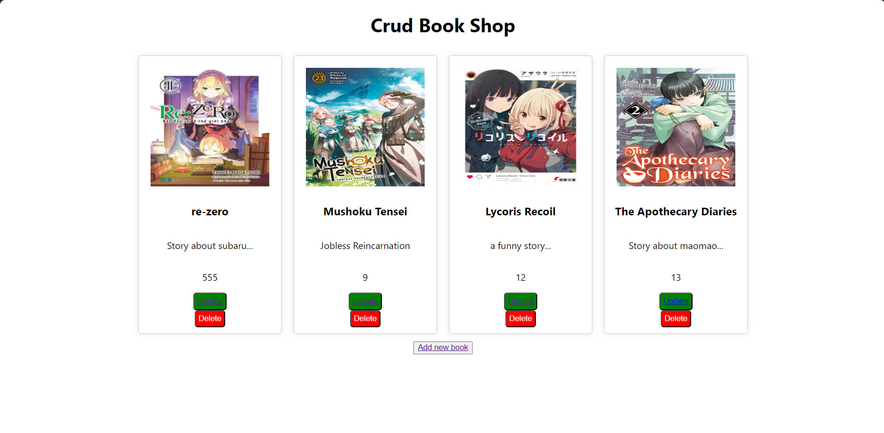

# CRUD Application

This project is a simple CRUD (Create, Read, Update, Delete) application to manage a list of books. The application uses a Node.js backend with Express and a React frontend.

## Features

- Create a new book entry
- Read and display all book entries
- Update an existing book entry
- Delete a book entry

## Technologies Used

- Frontend: React
- Backend: Node.js with Express
- Database: MySQL

## Project Structure

- **Backend**: Manages API endpoints to handle CRUD operations.
- **Frontend**: Provides a user interface to interact with the backend APIs.

